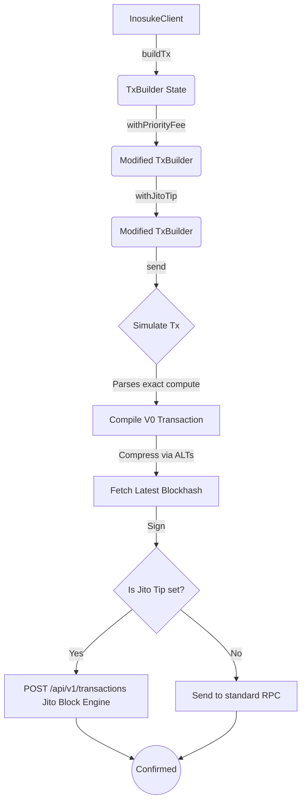

# Inosuke


Inosuke is a modern, lightweight, and professional-grade Solana TypeScript library designed to wrap the `@solana/kit` architecture with an ergonomic, fluent, and intuitive API. 

It aims to bridge the gap between low-level instruction building and high-level developer experience, bringing the power of Web3.js v2 into a framework that "just works."

---

## Why Inosuke? (Design Choices & Architecture)

Solana's transition to `@solana/web3.js` v2 (`@solana/kit`) introduced a powerful, functional-first, and highly modular architecture. However, wiring together RPC transformers, instruction pipelines, signers, and blockhash lifetimes manually can result in heavy boilerplate.

Inosuke makes **opinionated design choices** to maximize Developer Experience (DX) without sacrificing performance:

1. **Fluent `TxBuilder` Pattern:** 
   Transactions in Inosuke are built using an immutable builder pattern (`client.buildTx()`). Modifiers like `.withPriorityFee()` or `.withJitoTip()` return new instances, preventing state-mutation bugs and making code highly readable.
2. **Auto-Simulation & Compute Optimization:** 
   By default, Inosuke simulates every transaction locally before sending. It parses the simulation logs to extract the exact compute units consumed, applies a 10% safety buffer, and uses that for the final `ComputeBudget` instruction. This prevents frustrating `ComputeBudgetExceeded` errors.
3. **No ATA Boilerplate:** 
   Associated Token Accounts (ATAs) are notoriously tedious. Inosuke's token handlers (`transferToken`, `mintMore`) automatically resolve ATAs, and if a recipient doesn't have one, Inosuke injects the creation instruction inline.
4. **V0 and ALT Native:**
   Inosuke compiles transactions as Versioned Transactions (`v0`) by default, meaning Address Lookup Tables (ALTs) are supported out of the box via `.withAddressLookupTable()`. 
5. **Jito MEV Integration:**
   Inosuke bypasses the public mempool natively. Simply appending `.withJitoTip()` routes your transaction through the Jito Block Engine, preventing sandwich attacks and bypassing heavy network congestion.

---

## Architecture Flow



---

# How to Use

Below are the core capabilities and examples of how to use Inosuke.

## 1. Connecting to the Network

Inosuke uses a centralized `InosukeClient` via the `connect()` method to manage your RPC connections.

```typescript
import { connect } from 'inosuke';

// Connect using monikers: "devnet", "testnet", "mainnet", or "localnet"
const client = connect("mainnet");

// Or use a custom RPC URL:
const customClient = connect("https://my-rpc.helius.xyz/api-key");
```

---

## 2. Managing Keypairs

Inosuke makes it easy to generate, load, save, and export Solana keypairs securely.

```typescript
import { 
  generateKey, 
  generateExtractableKey, 
  loadKeyFile, 
  saveKeyFile, 
  toBase58 
} from 'inosuke';

// Generate a highly secure, non-extractable key for signing
const signer = await generateKey();

// Load an existing file (e.g., from Solana CLI)
const cliSigner = await loadKeyFile("~/.config/solana/id.json");

// Generate a key that you plan to save/export later
const exportableSigner = await generateExtractableKey();
await saveKeyFile(exportableSigner, "./my-key.json");

// Export to base58 (like Phantom secret keys)
const secretKey = await toBase58(exportableSigner);
```

---

## 3. Account & Network Utilities

You can easily query balances, request airdrops, find PDAs, and calculate rent.

```typescript
import { toSol, toLamport, findPda } from 'inosuke';

// Check SOL Balance
const balanceLamports = await client.balance(signer.address);
console.log("Balance:", toSol(balanceLamports), "SOL");

// Calculate Minimum Rent for an Account (e.g., 165 bytes for a Token Account)
const rent = await client.rentFor(165);

// Find Program Derived Addresses (PDAs) easily
const pda = await findPda(programId, ["my_seed", userAddressBytes]);
```

---

## 4. Fluent Transaction Builder (`TxBuilder`)

Inosuke replaces complex transaction boilerplate with a fluent, immutable `TxBuilder`.

```typescript
import { transferSol } from 'inosuke';

// Generate a transfer instruction
const { instructions } = await transferSol({
  from: signer,
  to: recipientAddress,
  amount: toLamport(1.5),
});

// Build the transaction
const result = await client
  .buildTx({ feePayer: signer, instructions })
  .withPriorityFee(1000n)          // Pay a priority fee (microLamports)
  .withComputeLimit(150_000)       // Override auto-simulation limit if needed
  .send();                         // Submits and confirms!

console.log("Transaction Confirmed! Signature:", result.signature);
```

### Advanced Routing: Jito & ALTs

Inosuke natively supports **Versioned Transactions (v0)** and offers advanced routing.

```typescript
// Compress your payload using Address Lookup Tables
const jupiterAlt = address("JUP6LkbZbjS1jKKwapdHNy74zcZ3tLUZoi5QNyVTaV4");

await client.buildTx({ feePayer: signer, instructions: hugeDeFiSwap })
  .withAddressLookupTable(jupiterAlt) // Resolves & compresses accounts behind the scenes
  .withJitoTip(10_000n)               // Routes directly to Jito Block Engine for MEV protection!
  .send();
```

---

## 5. SPL Tokens (Minting, Transferring, Burning, Queries)

Inosuke provides robust helpers for SPL tokens, completely abstracting away the hassle of Associated Token Accounts (ATAs).

### Querying Token Data
```typescript
// Get supply and decimals
const mintInfo = await client.getMintInfo(mintAddress);

// Get balances
const balance = await client.getTokenBalanceByOwner(mintAddress, userAddress);

// Fetch Metaplex Token Metadata (Name, Symbol, Logo)
const metadata = await client.getTokenMetadata(mintAddress);
console.log(metadata.name, metadata.symbol, metadata.uri);
```

### Minting a new Token
```typescript
import { mintToken, mintMore } from 'inosuke';

// Step 1: Create the mint
const { instructions: createMintIxs, mint } = await mintToken({
  decimals: 9,
  authority: signer,
  rentFor: (size) => client.rentFor(size),
});

await client.buildTx({ feePayer: signer, instructions: createMintIxs }).send();

// Step 2: Mint tokens to a wallet (Inosuke handles the ATA automatically!)
const { instructions: mintIxs } = await mintMore({
  mint: mint.address,
  authority: signer,
  recipient: signer.address,
  amount: 1_000_000_000n, // 1 Token
});

await client.buildTx({ feePayer: signer, instructions: mintIxs }).send();
```

### Transferring Tokens
```typescript
import { transferToken } from 'inosuke';

// Transfer tokens to another wallet. 
// If they don't have an ATA, Inosuke creates one inline!
const { instructions } = await transferToken({
  mint: mint.address,
  from: signer,           // Sender (TransactionSigner)
  to: recipientAddress,   // Recipient (Address)
  amount: 500_000_000n,   // 0.5 Tokens
  decimals: 9,
  payer: signer,          // Who pays for the ATA creation
});

await client.buildTx({ feePayer: signer, instructions }).send();
```

### Burning Tokens
```typescript
import { burnToken } from 'inosuke';

const { instructions } = await burnToken({
  mint: mint.address,
  owner: signer,
  amount: 100_000_000n, // 0.1 Tokens
  decimals: 9,
});

await client.buildTx({ feePayer: signer, instructions }).send();
```